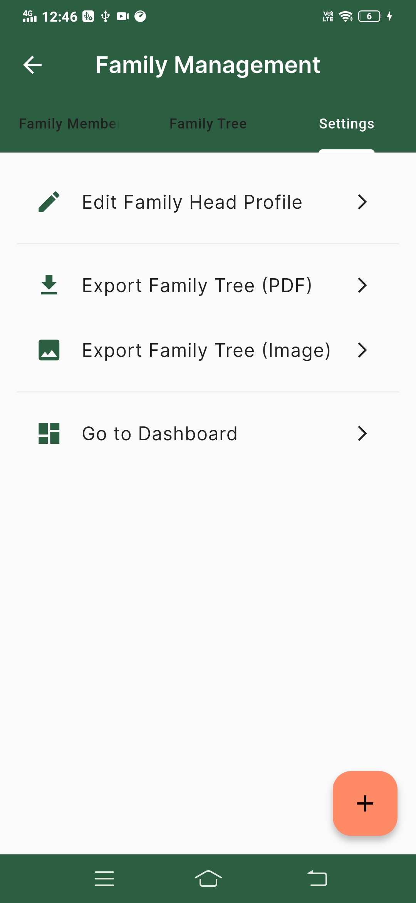

# Flutter

A modern Flutter-based mobile application utilizing the latest mobile development technologies and tools for building responsive cross-platform applications.

## 📋 Prerequisites

- Flutter SDK (^3.29.2)
- Dart SDK
- Android Studio / VS Code with Flutter extensions
- Android SDK / Xcode (for iOS development)

## 🛠️ Installation

1. Install dependencies:
```bash
flutter pub get
```

2. Run the application:
```bash
flutter run
```
## 📦 Download

[⬇️ Download APK](screenshot/app-release.apk)

## 🎬 Demo

[](screenshot/app_video.mp4)

## 📸 Screenshots

<table>
  <tr>
    <td></td>
    <td></td>
    <td></td>
  </tr>
  <tr>
    <td></td>
    <td></td>
    <td></td>
  </tr>
    <tr>
    <td></td>
    <td></td>
    <td></td>
  </tr>
  <tr>
    <td></td>
    <td></td>
  </tr>
</table>


## 🧩 Adding Routes

To add new routes to the application, update the `lib/routes/app_routes.dart` file:

```dart
import 'package:flutter/material.dart';
import 'package:package_name/presentation/home_screen/home_screen.dart';

class AppRoutes {
  static const String initial = '/';
  static const String home = '/home';

  static Map<String, WidgetBuilder> routes = {
    initial: (context) => const SplashScreen(),
    home: (context) => const HomeScreen(),
    // Add more routes as needed
  }
}
```

## 🎨 Theming

This project includes a comprehensive theming system with both light and dark themes:

```dart
// Access the current theme
ThemeData theme = Theme.of(context);

// Use theme colors
Color primaryColor = theme.colorScheme.primary;
```

The theme configuration includes:
- Color schemes for light and dark modes
- Typography styles
- Button themes
- Input decoration themes
- Card and dialog themes

## 📱 Responsive Design

The app is built with responsive design using the Sizer package:

```dart
// Example of responsive sizing
Container(
  width: 50.w, // 50% of screen width
  height: 20.h, // 20% of screen height
  child: Text('Responsive Container'),
)
```
## 📦 Deployment

Build the application for production:

```bash
# For Android
flutter build apk --release

# For iOS
flutter build ios --release
```
